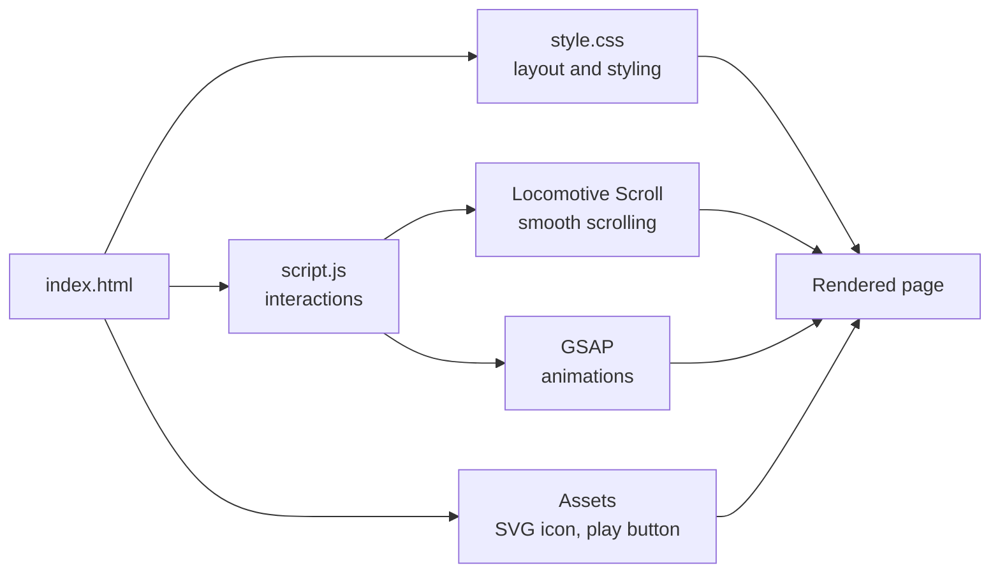

# Lazarev ✨

A front-end rebuild of the Lazarev agency website, made to practice scroll-driven animation and layout work. Plain HTML, CSS and JavaScript on the base, with GSAP handling the motion and Locomotive Scroll handling the smooth scrolling.

Live site: [lazarev-replica.vercel.app](https://lazarev-replica.vercel.app)

This is a learning project. The design belongs to the original Lazarev team, and I rebuilt it to see how that kind of polish is put together.

## Preview


<hr>

<hr>

<hr>


## Used technologies


## How the pieces fit



## Project files

```
Lazarev-Replica/
├── index.html                       # page markup
├── style.css                        # all styling
├── script.js                        # GSAP and Locomotive Scroll setup
├── arrow-up-right-svgrepo-com.svg   # arrow icon
└── play-button.png                  # play button image
```

## Running it locally

There's no build step. Clone the repo and open `index.html` in a browser.

```bash
git clone https://github.com/Bikram-sGit00/Lazarev-Replica.git
cd Lazarev-Replica
```

Smooth scrolling libraries can act up when a page is opened straight from disk, so if something looks off, serve the folder instead. The Live Server extension in VS Code works, or from the terminal:

```bash
# starts a local server at http://localhost:8000
python -m http.server 8000
```


